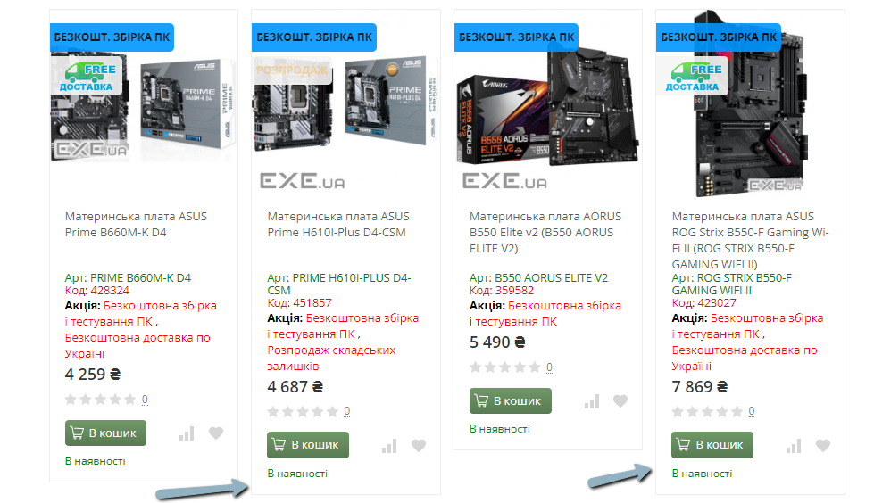

## [EXE-1] Product blocks on catalog page have inconsistent heights

**Severity:** Sev-3  
**Priority:** Low  

### Environment
- Windows 10, Google Chrome 123.0.6
- Android 13

### Preconditions
- Open the website https://exe.ua/ua/ in a browser

### Steps
1.	Click on “Каталог“(Catalog).
2.	Navigate to the “Материнські плати“ (Motherboards) category.
3.	Make sure there are several products displayed in a row.
4.	Visually compare the heights of the product blocks.

### Expected Result
All product blocks have the same height.

### Actual Result
Product blocks have different heights.

### Attachment

**Type of bug:**
Alignment
