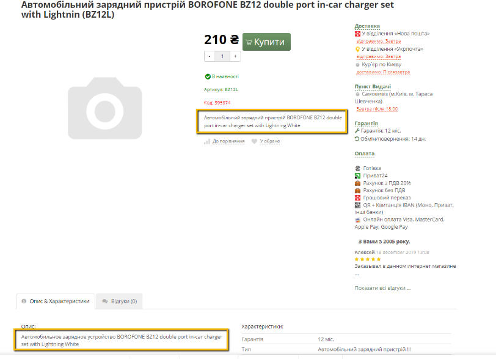

## [EXE-2] Duplicate product description on product page and in the "Description & Characteristics" tab

**Severity:** Sev-3  
**Priority:** Low  

### Environment
- Windows 10, Google Chrome 123.0.6
- Android 13

### Preconditions
- Open the website https://exe.ua/ua/ in a browser

### Steps
1.	Click on “Каталог“(Catalog).
2.	Navigate to the “Електроживлення“ (Power Supply) category.
3.	Go to subcategory “Зарядні пристрої USB та інші ...“(USB and other chargers).
4.	Select the product "Car charger BOROFONE BZ12 double port in-car charger set with Lightnin (BZ12L)".
5.	Observe the product description on the page.

### Expected Result
The product description is displayed only in the “Опис & Характеристики“ (Description & Characteristics) tab. 

### Actual Result
The product description is displayed both on the main product page and in the “Опис & Характеристики“ (Description & Characteristics) tab.

### Attachment

**Type of bug:**
User Interface
