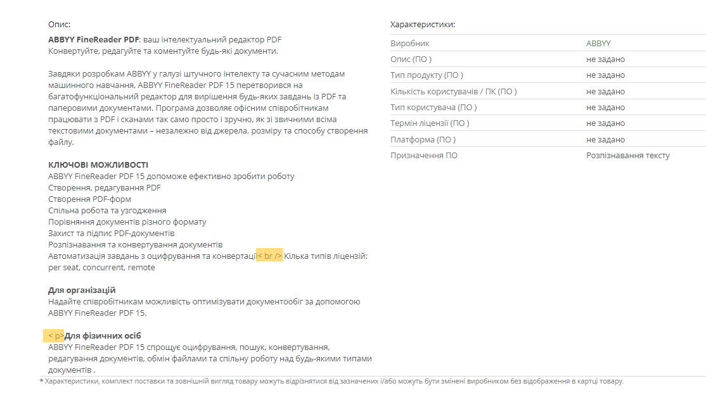

## [EXE-3] Incorrect text formatting: HTML tag is displayed instead of rendered content

**Severity:** Sev-3  
**Priority:** Low  

### Environment
- Windows 10, Google Chrome 123.0.6
- Android 13

### Preconditions
- Open the website https://exe.ua/ua/ in a browser

### Steps
1.	Click on “Каталог“(Catalog).
2.	Navigate to the “Програмне забезпечення“ (Software) category.
3.	Go to subcategory “Офісні програми“(Office software).
4.	Select the product “ABBYY FineReader”.
5.	Observe the product description on the “Опис & Характеристики“ (Description & Characteristics) tab and check the product description.

### Expected Result
The product description is displayed in a clean, readable format without HTML tags.  

### Actual Result
HTML tags, such as   and 
, are visible in the product description instead of being properly rendered.

### Attachment

**Type of bug:**
User Interface
